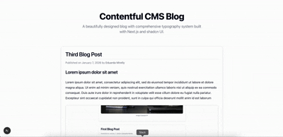

<p align="center">
  
  
  
</p>

<p align="center">
  <a href="https://github.com/eduardamirelly/contentful-cms-blog/issues/new/choose">Report Bug</a>
  ·
  <a href="https://github.com/eduardamirelly/contentful-cms-blog/issues/new/choose">Suggestions</a>
</p>

## 💻 Project

A modern blog application built with Next.js and Contentful CMS. Features rich text content, embedded assets, and a clean, responsive design.

## ✨ Technologies

-   [x] Next.js 16
-   [x] React 19
-   [x] TypeScript
-   [x] Tailwind CSS
-   [x] Contentful CMS
-   [x] shadcn/ui
-   [x] Lucide React

## 🚀 Deploy

-   [ ] Vercel

## 🏁 Running the project

### First Step [Install dependencies]

```bash
pnpm install
# or
npm install
```

### Second Step [Environment Variables]

Create a `.env.local` file in the root directory:

```bash
NEXT_PUBLIC_CONTENTFUL_SPACE=your_space_id
NEXT_PUBLIC_CONTENTFUL_TOKEN=your_access_token
```

### Third Step [Run development server]

```bash
pnpm dev
# or
npm run dev
```

Open [http://localhost:3000](http://localhost:3000) with your browser to see the result.

## 📄 License

This project is under the MIT license. See the [LICENSE](LICENSE) file for more details.